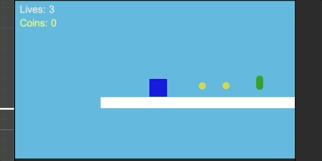
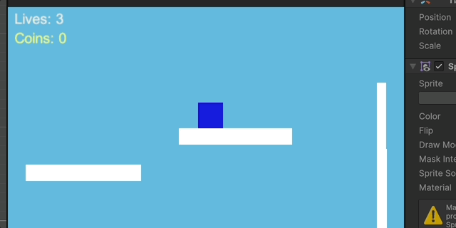

# Game Design

Play an MVP of a platformer video game similar to Mario.  
If further developed, the game will include complex levels, power-ups, and enemies.

### Example #1: Picking up coins, demonstrating shield power-up, and defeating an enemy

### Example #2: Reaching the end of the level

